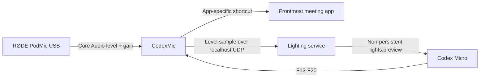

# Codex Micro Mic

Use a Work Louder Codex Micro as a live microphone level meter, hardware gain
control, and consistent meeting controller for Google Meet, Roam, Zoom, and
Microsoft Teams.

The Micro shows microphone level through color and brightness. Its encoder
changes the RØDE PodMic USB hardware gain in 1 dB steps, while six keys map to
the same meeting actions in every supported app.

> [!IMPORTANT]
> This is an unofficial community project. It is not affiliated with or
> endorsed by OpenAI, Work Louder, RØDE, Google, Zoom, or Microsoft.

## What it does

- Displays live input level across the Micro's backlight and underglow.
- Opens a compact native **Call Deck** from the menu bar, with a live meter,
  gain controls, and six meeting controls.
- Keeps exact dBFS level and hardware gain inside the Call Deck, not in the
  menu bar by default.
- Changes PodMic hardware gain without opening RØDE Central or RØDE Connect.
- Routes the same six physical buttons and Call Deck controls to the
  frontmost meeting app.
- Keeps the original Codex profile and its agent-status lighting intact.
- Processes microphone levels locally without saving or transmitting audio.

The device uses a color-plus-motion meter:

| Color | Input level | Meaning |
|---|---:|---|
| Dim gray | Below -50 dBFS | Silence |
| Blue | -50 to -20 dBFS | Quiet |
| Green | -20 to -6 dBFS | Healthy speech |
| Orange | -6 to -1 dBFS | Hot |
| Red | -1 dBFS or higher | Clipping risk |

Brightness changes within each band, so the device still moves like a meter.
The menu-bar waveform changes color only when the input crosses a level band,
so its width stays fixed and it does not flicker with every sample. The default
is **Waveform Only**, so no changing dB number occupies the menu bar while you
are not using the mic.

### Call Deck and menu-bar display

Click the menu-bar waveform to open **Call Deck**. It only enables meeting
controls when the frontmost app is Zoom or the dedicated Google Meet Chrome
app. That makes the target visible before a shortcut is sent and avoids
accidentally sending controls into an unrelated app.

If controls are disabled, choose **Enable meeting controls…** in Call Deck to
open macOS’s Accessibility approval. For Google Meet, use Chrome’s **Install
page as app** command on `meet.google.com`; the resulting dedicated app is the
safe target CodexMic recognizes.

If an ad-hoc rebuild causes the live meter to lose microphone access, use
**Enable microphone meter…** in Call Deck to open the relevant macOS privacy
setting.

The deck reports that a command was sent, not that the meeting application
accepted it. Mute is a toggle owned by Zoom or Google Meet, so CodexMic does
not show a fake muted/unmuted state.

Use **Menu Bar Display** in Call Deck to choose:

- **Waveform Only** — the smallest option and the default.
- **Waveform and Gain** — the waveform plus hardware gain.
- **Gain Only** — hardware gain without an icon.
- **Full Detail** — waveform, live dBFS level, and hardware gain.

CodexMic remembers the selection between launches. In every mode, the dropdown
keeps the exact live level and gain visible.

## Requirements

- macOS 13 or later
- Swift 5.9 or later
- [Work Louder Input](https://worklouder.cc/openai-micro-setup) installed at
  `/Applications/input.app`
- A Codex Micro
- A `RØDE PodMic USB` input device

Tested with Input 0.17.2 and Codex Micro firmware 0.4.1. The lighting adapter
uses a device library bundled inside Input, so a future Input update may
require an adapter update.

## Quickstart

### 1. Build and verify

```bash
git clone https://github.com/daniel-p-green/codex-micro-mic.git
cd codex-micro-mic
swift build
swift run CodexMicChecks
scripts/package-app.sh
```

The packaged application is created at `.build/CodexMic.app`.

### 2. Install the app

```bash
ditto --norsrc .build/CodexMic.app /Applications/CodexMic.app
open /Applications/CodexMic.app
```

macOS asks for Microphone access so CodexMic can read the live level. Add
`/Applications/CodexMic.app` under **System Settings > Privacy & Security >
Accessibility** so it can send meeting shortcuts.

The package is ad-hoc signed. Rebuilding and reinstalling it may cause macOS to
ask for permissions again.

### 3. Configure Input

Keep the original Codex profile at profile index `0`. Add a second profile
named **Meetings** at profile index `1`.

Create four labeled layers inside Meetings:

1. Google Meet
2. Roam
3. Zoom
4. Teams

Use the same keycodes on every layer:

| Physical control | Keycode | Action |
|---|---:|---|
| Large key 1 | F13 | Microphone |
| Large key 2 | F14 | Camera |
| Key 3 | F15 | Chat |
| Key 4 | F16 | Share screen |
| Key 5 | F17 | Raise or lower hand |
| Key 6 | F20 | Participants |
| Encoder counterclockwise | F18 | Gain -1 dB |
| Encoder clockwise | F19 | Gain +1 dB |
| Encoder press | Unassigned | Reserved |

Upload the profile, make Meetings current, and then quit Input. CodexMic waits
while the Input interface is open so the two processes do not compete for the
Micro's device channel.

Do not assign a one-touch **Leave meeting** action.

## Meeting shortcuts

CodexMic identifies the frontmost meeting app and sends the corresponding
shortcut:

| Action | Google Meet | Zoom | Teams |
|---|---|---|---|
| Microphone | Command-D | Command-Shift-A | Control-Shift-M |
| Camera | Command-E | Command-Shift-V | Control-Shift-O |
| Chat | Control-Command-C | Command-Shift-H | Not assigned |
| Share screen | Control-Command-T | Command-Shift-S | Control-Shift-E |
| Raise hand | Control-Command-H | Option-Y | Control-Shift-K |
| Participants | Control-Command-P | Command-U | Not assigned |

For Google Meet, install or create the dedicated Chrome app/PWA. CodexMic
matches its bundle identifier rather than treating every Chrome window as a
meeting.

Roam supports customizable shortcuts. Configure Microphone, Camera, Chat, and
Share screen to match the Google Meet column. Raise hand and Participants are
intentionally unassigned for Roam.

Unsupported app/action combinations fail safely instead of sending an
unrelated shortcut. In Zoom, disable **Automatically adjust microphone
volume** if the physical encoder should remain authoritative.

## How it works



The Swift menu-bar app performs three jobs:

1. It meters the selected PodMic input with `AVAudioEngine`.
2. It reads and writes the PodMic's Core Audio gain property.
3. It translates global F13-F20 hotkeys and Call Deck buttons into
   app-specific meeting shortcuts.

Meeting controls register even when the PodMic is disconnected. Only live
metering, gain, and Micro lighting require the PodMic.

Input's editor exposes static lighting effects, but its bundled Work Louder
library can send the firmware's non-persistent `lights.preview` command.
CodexMic launches a small Node sidecar through Input's Electron runtime and
sends it quantized lighting samples over UDP bound to `127.0.0.1`.

The sidecar applies previews only while profile index `1` is active. Returning
to profile `0` pauses the meter and protects the original Codex agent-status
lighting.

## Privacy and permissions

- Audio is metered in memory and is never recorded.
- No microphone samples leave the Mac.
- The lighting service listens only on `127.0.0.1`.
- Only color and brightness values are sent to the lighting service.
- Accessibility permission is used only to post documented meeting shortcuts.
- The app does not need a separate Input Monitoring permission because the
  lighting sidecar runs through Input's already-authorized device runtime.

Review the implementation in
[`AudioMeter.swift`](Sources/CodexMic/AudioMeter.swift),
[`MeetingController.swift`](Sources/CodexMic/MeetingController.swift), and
[`codex-micro-lighting-service.js`](support/codex-micro-lighting-service.js).

## Verify the installation

Run the deterministic checks:

```bash
swift run CodexMicChecks
node --check support/codex-micro-lighting-service.js
plutil -lint support/Info.plist
codesign --verify --deep --strict .build/CodexMic.app
```

The menu should report:

- `Meeting controls: ready`
- `Micro level lighting: live`
- A changing `Live level` value
- The PodMic's current `Hardware gain`

Test the six meeting buttons in a non-production call before relying on them.
Meeting applications can change shortcuts between releases.

## Troubleshooting

### Lighting says `waiting for Input to quit`

Finish editing or uploading the profile, make Meetings current, and quit
Input. CodexMic starts the lighting service automatically afterward.

### Lighting says `paused; select Meetings profile`

Select profile index `1` on the Micro. The meter deliberately leaves profile
index `0` untouched.

### Meeting controls need Accessibility permission

Enable `/Applications/CodexMic.app` in **System Settings > Privacy & Security >
Accessibility**, then relaunch CodexMic.

### The PodMic is not found

Confirm that macOS lists the input device exactly as `RØDE PodMic USB`. This
release intentionally targets that device and its writable hardware-gain
property.

### Lighting stopped after an Input update

Input may have moved or changed its bundled Work Louder device library. Gain,
metering, and meeting shortcuts can continue working while the lighting
adapter is updated.

## Development

```bash
swift build
swift run CodexMicChecks
scripts/package-app.sh
# Or use the project launcher / Codex Run button:
script/build_and_run.sh --verify
```

The repository contains:

| Path | Purpose |
|---|---|
| `Sources/CodexMic` | macOS menu-bar application |
| `Sources/CodexMicCore` | Deterministic meter and routing logic |
| `Sources/CodexMicChecks` | Executable verification suite |
| `support` | App metadata and lighting sidecar |
| `scripts/package-app.sh` | Local ad-hoc packaging |
| `tools` | PodMic diagnostics |

## License

Released under the [MIT License](LICENSE).

## References

- [Work Louder Codex Micro setup](https://worklouder.cc/openai-micro-setup)
- [Google Meet keyboard shortcuts](https://support.google.com/meet/answer/9298571)
- [Zoom keyboard shortcuts](https://support.zoom.com/hc/en/article?id=zm_kb&sysparm_article=KB0067050)
- [Microsoft Teams keyboard shortcuts](https://support.microsoft.com/en-us/accessibility/teams-keyboard-shortcuts-for-microsoft-teams)
- [Roam keyboard shortcuts](https://ro.am/support/keyboard-shortcuts)
- [RØDE PodMic USB user guide](https://rode.com/en-us/user-guides/podmic-usb)
